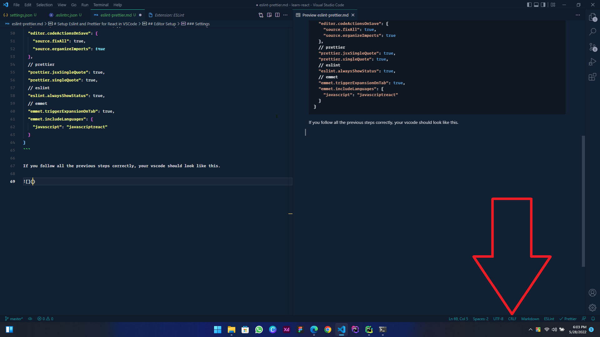

<!-- Project Title -->

# Setup Eslint and Prettier for React in VSCode

<!-- Table of Contents -->

## Table of Contents:

- [Editor Setup](#editor-setup)
  - [Plugins](#plugins)
  - [Settings](#settings)
  - [Set Line Breaks](#set-line-breaks)
- [Linting Setup](#)
  - [Dependencies](#)
  - [Configure Eslint and Prettier](#)

<!-- Editor Setup -->

## Editor Setup

You can use any plugin as you wish to. Here, I'm using VSCode editor.

### Plugins

You need to install the following plugins:

- **ESLint** - Microsoft
- **Prettier - Code formatter** - Prettier
- Learn with Sumit (Peace of the eye - Dracula version) - Sumit Saha **(Optional)**

### Settings

Follow the steps to create `settings.json` file inside the project root:

1. Create a folder/directory named `.vscode` inside the project root.
2. Create a file named `settings.json` inside the `.vscode` folder/directory.
3. Copy and paste the below `json` object into the `settings.json` file and save it.

```sh
{
  // editor
  "workbench.colorTheme": "Learn with Sumit - Peace of the eye - Dracula version",
  "editor.defaultFormatter": "esbenp.prettier-vscode",
  "editor.formatOnSave": true,
  "[javascript, javasscriptreact]": {
    "editor.formatOnSave": false,
    "editor.defaultFormatter": null
  },
  "javascript.validate.enable": false, //disable all built-in syntax checking
  "editor.codeActionsOnSave": {
    "source.fixAll": true,
    "source.organizeImports": true
  },
  // prettier
  "prettier.jsxSingleQuote": true,
  "prettier.singleQuote": true,
  // eslint
  "eslint.alwaysShowStatus": true,
  // emmet
  "emmet.triggerExpansionOnTab": true,
  "emmet.includeLanguages": {
    "javascript": "javascriptreact"
  }
}
```

If you follow all the previous steps correctly, your vscode should look like this.

## Set Line Breaks

Make sure in your VS Code Editor, "LF" is selected as line feed instead of CRLF (Carriage return and line feed). To do that, just click LF/CRLF in bottom right corner of editor, click it and change it to "LF". If you don't do that, you may have face errors.



## Linting Setup

In order to lint and format React project automatically according to most popular airbnb style guide, it is recommended to follow the instructions below:

### Dependencies

Install the following dev dependencies one by one.

```sh
npm i -D eslint prettier prettier-eslint eslint-config-prettier eslint-plugin-prettier
```

Or, if you are using `yarn` as your default package manager, try this:

```sh
yarn add -D eslint prettier prettier-eslint eslint-config-prettier eslint-plugin-prettier
```

To follow airbnb style guide run the command:

```sh
npx install-peerdeps --dev eslint-config-airbnb
```

### Configure ESLint and Prettier

Now its time to configure the ESLint and Prettier plugins to work together poperly. Create a linting config file manually in the project root folder/directory named `.eslintrc.json`

Copy and paste the followings into the `.eslintrc.json` file.

```sh
{
  "env": {
    "browser": true,
    "es2021": true,
    "node": true,
    "jest": true
  },
  "extends": [
    "plugin:react/recommended",
    "airbnb",
    "plugin:react/jsx-runtime",
    "prettier",
    "plugin:jsx-a11y/recommended"
  ],
  "parserOptions": {
    "ecmaFeatures": {
      "jsx": true
    },
    "ecmaVersion": "latest",
    "sourceType": "module"
  },
  "plugins": ["react", "prettier", "react-hooks"],
  "rules": {
    "no-console": "off",
    "react/jsx-one-expression-per-line": "off",
    "react/jsx-filename-extension": [
      1,
      {
        "extensions": [".js", ".jsx"]
      }
    ],
    "prettier/prettier": [
      "error",
      {
        "trailingComma": "es5",
        "singleQuote": true,
        "jsxSingleQuote": true,
        "overrides": [
          {
            "files": ["**/*.css", "**/*.scss", "**/*.html"],
            "options": {
              "singleQuote": false
            }
          }
        ],
        "printWidth": 80,
        "tabWidth": 2,
        "semi": true,
        "endOfLine": "auto"
      }
    ]
  }
}

```

## Contact

Amin Babu - <a href="mailto:amin.babu.bd@gmail.com">amin.babu.bd@gmail.com</a>
